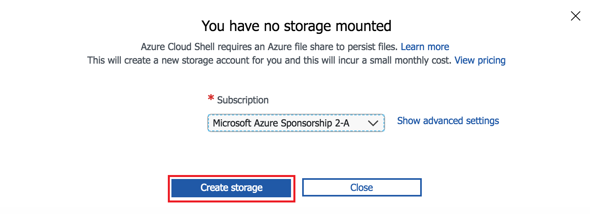

# Configuração do Ambiente do Lab

Esses laboratórios geralmente são entregues pelo **Azure Global Blackbelt Team**. Mas vamos adaptar o seu conteúdo e executá-lo usando uma subscrição de Azure (fornecido no evento) e uma VM de Linux com todas as ferramentas necessárias já instaladas.

## Setup do Ambiente

### 1. Azure Cloud Shell

1. Navegue até http://portal.azure.com
2. Logue-se com as credenciais de Azure fornecidas durante o evento.
3. Clique no ícone do Cloud Shell para iniciar sua sessão.

    

4. Selecione `Bash (Linux)`

5. Clique em `Create storage`

    

> Nota: Você também pode usar uma sessão dedicada do Azure Cloud Shell através da URL: http://shell.azure.com 

### 2. Deploy de sua Linux VM

1. Abra uma sessão do Cloud Shell e use os seguintes comandos:

```bash
$ wget https://raw.githubusercontent.com/CSELATAM/global-devops-bootcamp/master/resources/deploy-lab.sh
$ chmod +x deploy-lab.sh
$ ./deploy-lab.sh VHDURL
```

Após rodar o script acima, você deverá obter como saída o seguinte log:

```bash
Started!

Creating resource group x on y...
Resource group x created.

Creating storage account w on x...
Storage created.

Starting copy of Lab VHD disk to z...
Finished 1 of total 1 file(s).
[2018/06/12 04:31:34] Transfer summary:
-----------------
Total files transferred: 1
Transfer successfully:   1
Transfer skipped:        0
Transfer failed:         0
Elapsed time:            00.00:08:46
VHD disk copied.

Creating your VM...
VM created.

Updating Username and Password...
Finished updating Username and Password.

Updating Firewall rules...
Finished updating Firewall rules.

Getting your VM public IP...
Access your VM using:
ssh azureuser@xyz.xyz.xyz.xyz

Finished!
```

Use o IP acima para conectar-se em sua VM via SSH. (Caso não tenha instalado um cliente ssh e estiver no Windows, tente [Putty](https://www.putty.org/), por exemplo).

```bash
$ ssh azureuser@xyz.xyz.xyz.xyz
```

## Auto-guiado

É possível fazer o laboratório em sua própria máquina. Você precisará dos seguintes componentes disponíveis/instalados:

* Conta de Azure
* Conta no GitHub e git tools
* Linux, Mac ou Windows com Bash
* Docker
* Azure CLI
* Kubernetes CLI (kubectl)
* npm
* Node.js (apenas o lab #1 precisa dele)
* MongoDB (apenas o lab #1 precisa dele)
* Visual Studio Code (ou outro editor)
